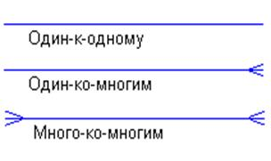

[<< Назад к оглавлению](./Contents.md)

# Реляционные модели данных

| product\_id | name | category | size | color               | price  |
| ----------- | ---- | -------- | ---- | ------------------- | ------ |
| 1           | А    | Обувь    | 42   | Черный              | 500,00 |
| 2           | Б    | Обувь    | 38   | Зеленый             | 870,00 |
| 3           | В    | Фигня    | 99   | Серо-буро-малиновый | 800,00 |

**Записи** — строки таблицы.

**Поля** — столбцы таблицы.

**Ключ/ключевое поле** — поле, значение которого однозначно идентифицирует записи в таблице.

**Составной ключ** — запись идентифицируется сцепкой полей (ключ, состоящий из нескольких полей).

Таблица может содержать несколько ключей, но один из них всегда первичный. Остальные ключи — потенциальные ключи. Значения не могут быть пустыми (NULL) и обязаны быть уникальными.

**Естественный ключ** — первичный ключ, образованный информационным полем таблицы.

**Суррогатный ключ** — первичный ключ, искусственно введённый в таблицу для идентификации.

Таблицы связаны между собой с помощью ключевых полей.

**Внешний ключ** — это поле, значение которого соответствует первичному ключу в другой таблице.

| Категории |              |
| --------- | ------------ |
| PK        | ID категории |

| Товары |              |
| ------ | ------------ |
| PK     | ID товара    |
| FK     | ID категории |

`Товары.FK -> Категории.PK`

FK — foreign key

Внешний ключ должен быть равен одному из значений первичного ключа другой таблицы либо быть полностью неопределённым.

### Виды связей:
- один ко многим (1:M)
- многие к одному (M:1)
- многие к многим (M:M)

визуальное представление концов стрелочек на графических схемах и диаграммах:

---

примеры в лоб от меня:

###### **один ко многим:**

в вузе есть группы и есть студенты. ***одна*** группа Б24-78Х-Х относится ***к многим*** студентам

| id  | name      | year |
| --- | --------- | ---- |
| 1   | Б24-780-1 | 2024 |
| 2   | Б24-780-2 | 2024 |

| id     | full\_name    | group\_id |
| ------ | ------------- | --------- |
| 100500 | Илья Кузнецов | 1         |
| 100501 | Носков Артем  | 2         |

###### **многие к одному**:

фактически это одно и то же. вопрос формулировки и построения фразы.

если мы в предыдущем примере повернем фразу наоборот - "***многие*** студенты относятся ***к одной*** группе Б24-78Х-Х"

###### **многие к многим**:

студенты ⇄ предметы

`STUDENTS`

| id  | full\_name    |
| --- | ------------- |
| 123 | Ilya Kuznecov |
| 456 | Ivanov Ivan   |

`SUBJECTS`

| id  | title |
| --- | ----- |
| 1   | math  |
| 2   | PE    |

связь многие ко многим очень часто характеризуется 3 табличкой в которой и приведено отношение многие ко многим:

`GRADES`

| id  | student\_id | subject\_id | mark |
| --- | ----------- | ----------- | ---- |
| 1   | 123         | 1           | 4    |
| 2   | 123         | 2           | 5    |
| 3   | 456         | 1           | 5    |
| 4   | 456         | 2           | 3    |

---

## Свойства реляционных баз данных

* Данные хранятся в таблицах, состоящих из столбцов (полей) и строк (записей).
* На пересечении каждого столбца и строки допускается только 1 значение.
* В таблице может не быть ни одной записи, но обязательно должно быть хотя бы одно поле.
* Каждое поле имеет имя и определённый тип данных, которому соответствуют все значения в этом поле.
* Имя поля и его тип данных задаются при создании таблицы.
* Порядок записей не закреплён. В таблице может не быть ни одной записи, но должно быть хотя бы одно поле.
* Записи в таблице не повторяются, следовательно, всегда можно определить первичный ключ.

## Нормализация реляционных баз данных

* **Нормальная форма** — это совокупность требований к структуре таблицы, которая характеризует избыточность зависимостей между полями таблицы.
* **Нормализация** — преобразование схемы (структуры) базы данных в другую эквивалентную схему с устранением избыточных зависимостей.
* **Цель нормализации** — сократить избыточность данных и нежелательные аномалии вставки, обновления и удаления данных.

### Аномалия вставки данных

| ид студента | имя | программу обучения | факультет | телефон деканата |
| ----------- | --- | ------------------ | --------- | ---------------- |

* Если для студента не известна программа обучения, при записи придётся указывать NULL сразу в трёх полях.
* При добавлении записей о 100 студентах одной программы обучения информация о факультете и деканате будет повторяться 100 раз.

## Уровни нормальных форм

1. Первая нормальная форма (1НФ)
2. Вторая нормальная форма (2НФ)
3. Третья нормальная форма (3НФ)
4. BCNF
5. Четвёртая нормальная форма
6. Пятая нормальная форма

> На практике достаточно 3 нормальной формы (3НФ).

### Первая нормальная форма (1НФ)

1. Все поля таблицы должны иметь только атомарные значения.
2. Значения одного поля таблицы должны иметь один тип данных.
3. Все столбцы должны иметь уникальные имена.
4. Порядок хранения записей не должен иметь значения.

**Пример ошибки:**

| ид  | имя         | телефон     | навыки          |
| --- | ----------- | ----------- | --------------- |
| 1   | сотрудник А | 88005557535 | питон, жс       |
| 2   | сотрудник В | 89009871239 | хтмл ксс жс     |
| 3   | сотрудник с | 79984321567 | жава линукс с++ |

(навыки — ошибка) — занесён список.

1НФ — разместить каждый навык в отдельной строке.

| ид  | имя         | телефон     | навык |
| --- | ----------- | ----------- | ----- |
| 1   | сотрудник А | 88005557535 | питон |
| 1   | сотрудник А | 88005557535 | жс    |
| 2   | сотрудник В | 89009871239 | хтмл  |
| 2   | сотрудник В | 89009871239 | ксс   |
| 2   | сотрудник В | 89009871239 | жс    |

## Функциональная зависимость

χ -> Υ

* Y функционально зависит от поля X, если каждому значению X соответствует ровно одно Y.
* При нормализации базы данных устраняются избыточные функциональные зависимости.

**Примеры:**

* ид сотрудника -> дата рождения
* дата рождения -> ид сотрудника **НЕЛЬЗЯ**
* подразделение -> руководитель подразделения
* ид сотрудника -> должность (зависит от того, возможно ли совмещение должностей)

### Выписать все функциональные зависимости:

* ид — дата, заказчик, емаил
* дата
* заказчик -> 1 емаил
* емаил
* товар
* цена
* количество

## Вторая нормальная форма (2НФ)

1. Таблица находится в 1НФ.
2. Должны отсутствовать частичные функциональные зависимости неключевых полей от первичного ключа.

**Частичная функциональная зависимость** — это функциональная зависимость неключевого атрибута от части первичного ключа.

**Пример 1:**

Есть частичная зависимость:

* ид заказа, ид товара -> заказчик
* ид заказа, ид товара -> наименование товара

Нет частичной зависимости:

* ид заказа, ид товара -> цена, количество

> Если таблица содержит составной первичный ключ все остальные поля должны зависеть функционально от составного ключа в целом а не от его части.

## Третья нормальная форма (3НФ)

* Должна быть во 2НФ.
* Должны отсутствовать транзитивные зависимости между полями таблицы.

**Транзитивная зависимость:**

Неключевое поле функционально зависит от другого поля, которое не входит в первичный ключ или является частью составного первичного ключа.

**Пример 1:**

Хранение грузов на складе.

Поля: **Груз**, Склад, Объём склада

* груз — склад
* груз — объём склада
* склад — объём склада

Транзитивность нарушена.

**Пример 2:**

Не в 3НФ:

| ид  | название | препод | емаил |
| --- | -------- | ------ | ----- |

## Нормальная форма Бойса-Кодда (BCNF)

1. Таблица в 3НФ.
2. детерминанты всех функциональных зависимостей являются потенциальными ключами.

**Пример:**

| зал | время начала | время окончания | тариф             |
| --- | ------------ | --------------- | ----------------- |
| 1   | тогда        | потом           | 1 зал без питания |
| 1   | уже          | сейчас          | 1 зал с питанием  |
| 2   | через 5 сек  | скоро           | 2 зал с питанием  |
| 2   | потом        | когда-нибудь    | 1 зал с питанием  |

Возможная проблема: по ошибке тариф для зала 2 может быть приписан к бронированию зала 1 или наоборот.

---

[<< Назад к оглавлению](./Contents.md)

