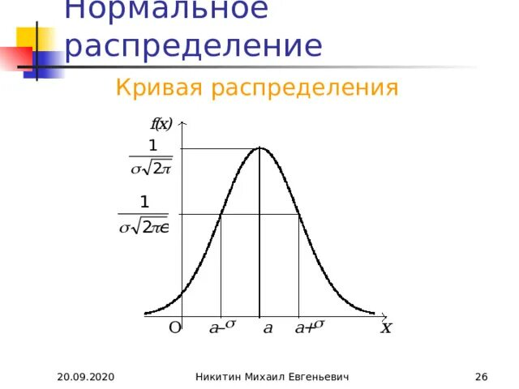
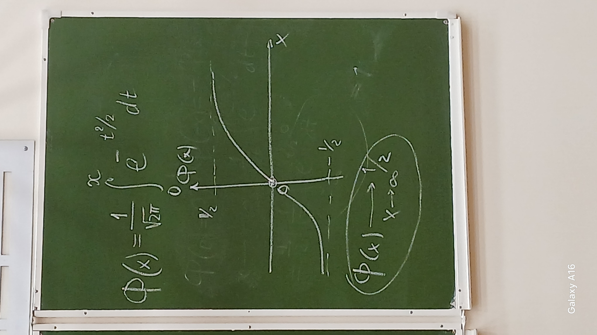

## Локальная формула Муавра-Лапласа

### Теорема 2.4 (локальная теорема Муавра-Лапласа)

Пусть
$$x = \frac{m - np}{\sqrt{npq}}  $$

Тогда:

$$P_n(m) \approx \frac{1}{\sqrt{npq}} \cdot \frac{1}{\sqrt{2\pi}} e^{-x^2/2} \tag{2.6}$$

$$\phi(x) = \frac{1}{\sqrt{2\pi}} e^{-x^2/2} \tag{2.7}$$

Формула Гаусса

$$P_n(m) \approx \frac{1}{\sqrt{npq}} \cdot \phi(x)$$

---

### Теорема 2.5 (интегральная теорема Муавра-Лапласа)

$$ P_n(m_1 \leq m \leq m_2) $$

Интегральная формула Лапласа:

$$ P_n\left(a \leq \frac{m-np}{\sqrt{npq}} \leq b\right) \approx \frac{1}{\sqrt{2\pi}} \int_a^b{e^{-t^2/2} dt} \tag{2.8} $$

$$ -\infin \leq a \leq b \leq +\infin $$

$$ \Phi(x) = \frac{1}{\sqrt{2\pi}} \int_0^x{e^{-t^2/2} dt} \tag{2.9} $$

### Функция Лапласа

$$ \Phi(0) = 0, $$

$$ \Phi(-x) = -\Phi(x) \tag{2.10} $$

при $x \to +\infin$:

$$ \frac{1}{\sqrt{2\pi}} \int_0^{+\infin} ...$$

$$ \Phi(x) \to 1/2; \quad x \to \infin $$

[Ранее интегральная формула Лапласа](#eq-2-8)
$$ \frac{1}{\sqrt{2\pi}} \int_a^b{e^{-t^2/2} dt} = $$

$$\frac{1}{\sqrt{2\pi}} \int_0^b{e^{-t^2/2} dt} - \frac{1}{\sqrt{2\pi}} \int_0^a{e^{-t^2/2} dt}  $$

---

$$ P_n(m_1 \leq m \leq m_2) =

P_n\left(
    \frac{m_1-np}{\sqrt{npq}} \leq
    \frac{m-np}{\sqrt{npq}} \leq
    \frac{m_2-np}{\sqrt{npq}} \right) = $$
$$
= \Phi\left(\frac{m_2-np}{\sqrt{npq}}\right) - \Phi\left(\frac{m_1-np}{\sqrt{npq}}\right) \tag{2.11}
$$

Формула Муавра-Лапласа работает лучше при $p \approx q$.

Особенности приближения при малых $p$ — мы хотим по-прежнему вычислить вероятность, и $p$ мало.

Пусть
$$n \rightarrow \infin$$
$$p = p(n) = p_n \rightarrow 0$$
$$np \rightarrow \lambda = const$$